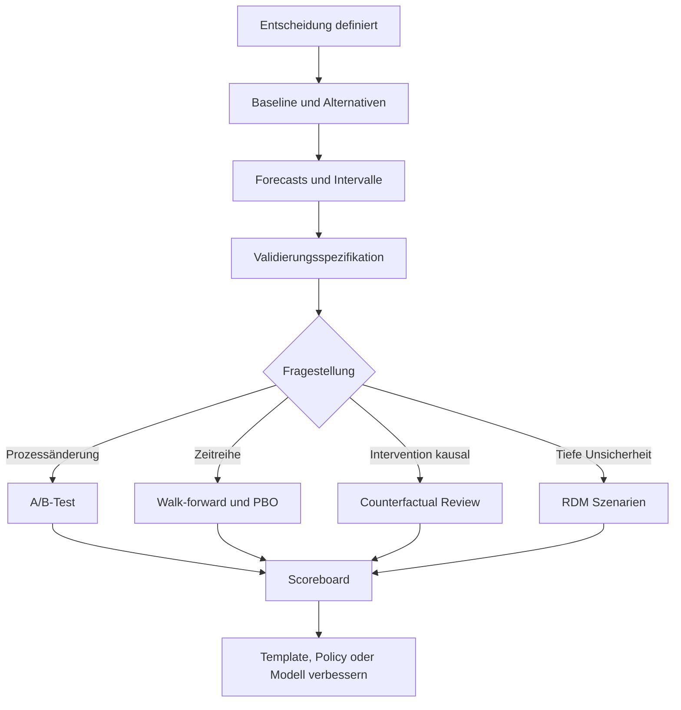
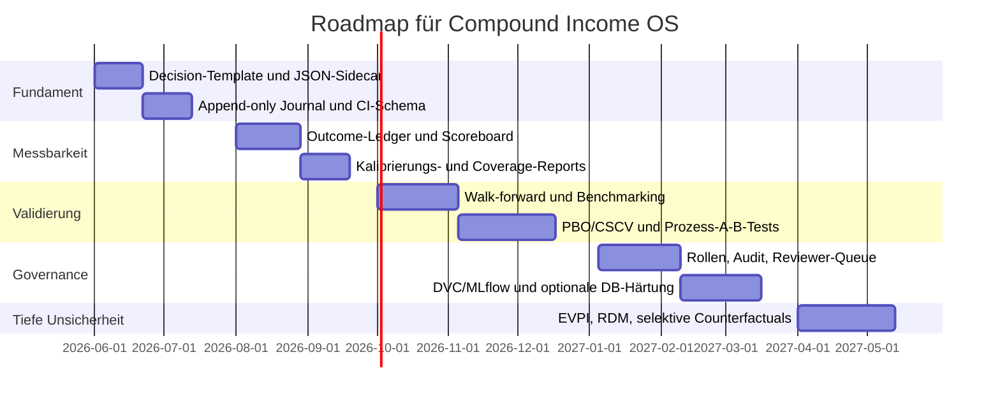

# Bewertungsrahmen für Compound Income OS unter Unsicherheit

## Executive Summary

Compound Income OS ist laut den bereitgestellten Projektunterlagen als **lokal-first**, **deterministisch**, **human-in-the-loop**, **evidence-over-opinion** und **review-gated** angelegt; Entscheidungen sollen nachvollziehbar dokumentiert, nicht automatisch exekutiert und in einer append-only Historie festgehalten werden. Genau diese Architektur begünstigt einen Aufbau, der **Entscheidungsqualität als messbares Systemverhalten** behandelt, statt nur gute Ergebnisse ex post zu erzählen. fileciteturn0file0 fileciteturn0file1 fileciteturn0file2

Die höchste erwartete Wirkung für Compound Income OS entsteht nicht durch einen einzelnen „smarten“ Prognosebaustein, sondern durch die Kombination aus: **strukturierten Entscheidungsakten**, **expliziten Wahrscheinlichkeitsangaben**, **reproduzierbaren Validierungs-Workflows**, **proper scoring rules** und **Governance mit effektiver Challenge**. Genau diese Elemente werden in der wissenschaftlichen Literatur und in offiziellen Governance-Standards immer wieder als Kern guter Entscheidungen unter Unsicherheit hervorgehoben. Strikt proper scoring rules fördern ehrliche probabilistische Aussagen; gute Kalibrierung heißt, dass vorhergesagte Wahrscheinlichkeiten empirisch zu beobachteten Häufigkeiten passen; moderne Model-Risk-Governance verlangt risikobasierte Validierung, Dokumentation, Inventarisierung und laufendes Monitoring. citeturn25view0turn29view0turn7search2turn20view0

Für Compound Income OS ist deshalb der **empfohlene Prioritätspfad**: zuerst ein belastbares Entscheidungsjournal mit Metadaten und Versionsbezug, danach ein Forecast- und Score-Layer mit Brier Score, Coverage und Regret, anschließend reproduzierbare Backtests und Prozess-Experimente, und erst danach schwerere Bausteine wie vollständige Lineage-Plattformen, formale EVPI-Automatisierung oder umfangreiche Counterfactual Engines. Diese Reihenfolge minimiert Implementierungsrisiko und maximiert früh messbaren Nutzen. citeturn25view9turn25view8turn25view10turn25view11turn25view12turn26view0

Der wichtigste methodische Punkt ist: **Compound Income OS sollte nicht nur „richtig“ entscheiden wollen, sondern systematisch zeigen können, warum eine Entscheidung zu einem Zeitpunkt rational war, wie unsicher sie war, wie gut frühere Unsicherheitsangaben kalibriert waren und welche Regeln sich aus den Ergebnissen verbessern lassen**. Das reduziert Outcome Bias, verbessert Lernschleifen und trennt Prozessqualität von Glück oder Pech. citeturn25view7turn30view7turn25view2turn30view8

## Bewertungsrahmen und Zielbild

Die bereitgestellten Projektunterlagen deuten auf vier operative Ziele hin: **Dokumentation**, **Erklärung**, **Validierung** und **iterative Verbesserung** von Entscheidungen, jeweils unter expliziter Unsicherheit und ohne automatische Broker- oder Order-Logik. Daraus folgt als geeignete Bewertungslogik für Konzepte in Compound Income OS: Ein Konzept ist dann gut, wenn es gleichzeitig die **Nachvollziehbarkeit** erhöht, **Unsicherheit quantifiziert**, **spätere Prüfung** erlaubt und **Lernsignale** erzeugt, die in Regeln, Templates oder Modelle zurückgeführt werden können. fileciteturn0file0 fileciteturn0file1 fileciteturn0file2

Wissenschaftlich und regulatorisch gut abgestützt ist dafür ein Sechs-Kriterien-Raster:  
**Traceability**, **Uncertainty quality**, **Validation strength**, **Reproducibility**, **Governance fit** und **Adoption cost**. PROV-O zeigt, wie Provenienz standardisiert repräsentiert und ausgetauscht werden kann; MADR/ADR liefert eine schlanke Form für begründete Entscheidungen; proper scoring rules liefern messbare Qualitätsfunktionen für probabilistische Aussagen; die revidierte US-Leitlinie zu Model Risk Management betont risikobasierte Governance, Modellinventar, Dokumentation, Validierung und laufendes Monitoring; BaFin und BSI spiegeln dies auf Deutsch in Validierungs-, Berechtigungs- und Protokollierungsanforderungen wider. citeturn25view8turn25view9turn25view0turn20view0turn21search5turn21search14turn21search6turn14search10turn14search3

Für Compound Income OS ist deshalb ein Konzept **hoch priorisiert**, wenn es in kurzer Zeit drei Dinge liefert: erstens saubere Artefakte im Repository, zweitens Metriken, drittens Review-Fähigkeit. Ein Konzept ist **mittlere Priorität**, wenn es gute Theoriebasis hat, aber erst auf aussagekräftigen Vorstufen aufbaut, etwa EVPI oder systematische Gegenfaktenanalyse. Ein Konzept ist **späte Priorität**, wenn es viel Infrastruktur benötigt, bevor es messbaren Mehrwert erzeugt. Diese Priorisierung ist eine analytische Synthese aus den Quellen und den Projektzielen. citeturn20view0turn25view12turn25view11turn25view10turn26view0


Dieses Zielbild passt gut zu einem System, das Erklärbarkeit und Reviewbarkeit höher gewichtet als vollautomatische Ausführung. Für tief unsichere Situationen ist das auch fachlich plausibel: Robust Decision Making empfiehlt gerade dann, nicht auf einen einzelnen Best-Estimate zu optimieren, sondern über viele plausible Zukünfte die Robustheit einer Handlungsoption zu prüfen. citeturn26view0turn26view1

## Priorisierte Konzeptmatrix

**Entscheidungsakte im ADR-Stil.**  
**Kurzbeschreibung:** Jede materielle Entscheidung erhält ein kurzes, versionskontrolliertes Record mit Kontext, Optionen, Baseline, Annahmen, Evidenz, gewählter Aktion, Triggern zur Revision und offenem Unsicherheitsbild. ADR/MADR ist dafür bewusst leichtgewichtig und in Git gut wartbar. citeturn25view9turn2search21  
**Bezug zu Compound Income OS:** Sehr hoch, weil es die bereits gewünschte journalartige, review-gated und menschlich verantwortete Entscheidungsdokumentation direkt operationalisiert. fileciteturn0file0 fileciteturn0file2  
**Messbare KPIs:** Anteil materieller Entscheidungen mit vollständigem Record; Median-Zeit bis Eintrag; Anteil Einträge mit expliziter Baseline; Anteil Records mit Revisions-Trigger; Review-Quote innerhalb definierter Frist.  
**Implementierung:** Markdown-Template im Repo; Pflichtfelder; Status-Workflow (`draft`, `approved`, `superseded`, `rejected`); Links auf Report, Run-ID, Snapshot-ID; PR-Review bei materialen Änderungen.  
**Ressourcen:** 1 Engineer, 1 Domain Owner, 1 Reviewer; 1–2 Personenwochen.  
**Risiken/Limitationen:** Zu viel Freitext senkt Vergleichbarkeit; zu viele Pflichtfelder senken Adoption.  
**Beispielartefakt:** `docs/decisions/2026-06-XX_DECISION_xxxx.md`.

**Metadaten, Provenienz und Versionierung.**  
**Kurzbeschreibung:** Neben dem lesbaren Decision Record braucht Compound Income OS maschinenlesbare Provenienz: Wer hat wann mit welchen Inputs, Code-Ständen, Datenschnitten, Parametern und Policies eine Empfehlung oder Entscheidung erzeugt. PROV-O ist der Referenzrahmen; DVC und ähnliche Werkzeuge koppeln Daten-, Modell- und Code-Versionen an Git-Historie. citeturn25view8turn25view10  
**Bezug zu Compound Income OS:** Extrem hoch, weil lokale, deterministische und reproduzierbare Reviews ohne robuste Provenienz kaum prüfbar sind. fileciteturn0file0 fileciteturn0file1  
**Messbare KPIs:** Anteil Entscheidungen mit vollständigem `run_id`-, `commit_sha`-, `dataset_id`- und `policy_ref`-Bezug; Reproduktionsrate identischer Outputs; Zeit bis Root-Cause bei Abweichung; Zahl ungeklärter „unknown provenance“-Fälle.  
**Implementierung:** JSON/YAML-Sidecar pro Entscheidung; standardisierte IDs; Hashes für Daten-Snapshots; Git-Commit-Verweise; optional DVC für Daten und Modelle.  
**Ressourcen:** 2–3 Personenwochen, später optional 2–4 weitere für DVC/Registry.  
**Risiken/Limitationen:** Hash- und Snapshot-Disziplin muss konsequent sein; sonst entsteht nur Scheingenauigkeit.  
**Beispielartefakt:** `artifacts/decision_packets/<decision_id>.json`.

**Probabilistische Prognosen und Unsicherheitsobjekte.**  
**Kurzbeschreibung:** Materielle Aussagen werden nicht nur textlich, sondern als Wahrscheinlichkeiten oder Intervalle gespeichert. Gute probabilistische Prognosen sollen **kalibriert** und gleichzeitig **scharf** sein; proper scoring rules sind dafür die geeignete Bewertungslogik. Konfidenzintervalle geben einen wahrscheinlichen Bereich für unbekannte Parameter an, wobei NIST für Anteilsgrößen ausdrücklich robuste Intervallverfahren wie Wilson hervorhebt. citeturn29view0turn25view0turn33view0turn33view1  
**Bezug zu Compound Income OS:** Sehr hoch, weil Entscheidungen unter Unsicherheit nur lernfähig werden, wenn Unsicherheit explizit gespeichert wird.  
**Messbare KPIs:** Anteil Entscheidungen mit mindestens einer numerischen Hypothese; empirische Coverage von 50/80/95%-Intervallen; Median-Brier-Score pro Horizont; Anteil Forecasts mit Ablaufdatum und Resolution-Kategorie.  
**Implementierung:** Für jede Entscheidung 1–3 testbare Hypothesen; Wahrscheinlichkeits- oder Intervallfeld; definierter Beobachtungszeitpunkt; späteres Outcome-Mapping. Optional Bayesian Updating für Revisionszyklen. citeturn25view16  
**Ressourcen:** 2–4 Personenwochen plus Domänenarbeit zur Frage- und Outcome-Definition.  
**Risiken/Limitationen:** Schlecht definierte Fragen erzeugen nutzlose Scores; Konfidenzintervalle werden oft fälschlich als subjektive „Sicherheit“ gelesen.  
**Beispielartefakt:** `forecast_hypothesis`, `p_event`, `interval_low`, `interval_high`, `horizon_date`.

**Validierungs- und Replikations-Workbench.**  
**Kurzbeschreibung:** Entscheidungsqualität unter Unsicherheit wird nicht durch eine einzige Validierungsmethode gesichert. Online-Experimente sind stark, wenn UI-, Prompt- oder Informationsarchitektur getestet wird; Walk-forward- oder zeitgerechte OOS-Verfahren sind zentral für Zeitreihen; White’s Reality Check und PBO/CSCV adressieren Data-Snooping und Backtest Overfitting; Counterfactuals sind hilfreich, aber nur bei plausibler kausaler Identifikation. citeturn25view3turn28view0turn28view3turn27view2turn4search3turn4search7  
**Bezug zu Compound Income OS:** Hoch, aber erst nach sauberer Dokumentation und Outcome-Zuordnung maximal wirksam.  
**Messbare KPIs:** Reproduzierbare Backtest-Läufe; Anteil Validierungen mit dokumentiertem Benchmark; Leak-Rate; PBO; Anteil A/B-Tests mit definierter OEC; Counterfactual-Reviews mit expliziter Identifikationsannahme.  
**Implementierung:** Zuerst Backtesting + Walk-forward + Baseline-Vergleich; dann Prozess-A/B für Reports, Decision Prompts, Review-Queues; Counterfactuals nur für klar definierte Interventionen.  
**Ressourcen:** 4–8 Personenwochen.  
**Risiken/Limitationen:** Naive Holdout-Setups unterschätzen Overfitting; reine Ex-post-Ergebnisdiskussion fördert Outcome Bias. citeturn28view2turn25view7turn30view7  
**Beispielartefakt:** `validation_spec.yaml`, `backtest_run.json`, `ab_test_readout.md`.

**Scoreboard für Entscheidungsqualität und Verbesserung über Zeit.**  
**Kurzbeschreibung:** Gemessen werden muss nicht nur Rendite oder Trefferquote, sondern die Qualität des Entscheidungsprozesses selbst. Dafür sind Brier Score, Reliability/Resolution/Uncertainty, Coverage Error, adaptive Calibration Error, EVPI und Regret geeignet. Brier und andere proper scoring rules belohnen ehrliche Wahrscheinlichkeiten; ECE allein ist problematisch, weil Wahl von Binning und Definition die Rangfolge von Recalibration-Methoden verzerren kann. EVPI macht den Maximalwert zusätzlicher Information sichtbar; Regret misst Opportunitätsverlust relativ zur ex-post besseren Alternative. citeturn25view0turn29view1turn31view0turn31view1turn30view9turn23search13turn23search17  
**Bezug zu Compound Income OS:** Extrem hoch; ohne Scoreboard gibt es keine belastbare Lernschleife.  
**Messbare KPIs:** Brier pro Horizont und Themenklasse; Coverage Deviation; Calibration Slope/Plot-Abweichung; EVPI pro Research-Frage; realized regret pro Entscheidungstyp; Review-Lag; Anteil Template-Verbesserungen, die Scores tatsächlich verbessern.  
**Implementierung:** Outcome-Ledger; nightly scoring job; Dashboard nach Horizont, Asset-Typ, Entscheidungstyp, Analyst, Policy-Version.  
**Ressourcen:** 2–5 Personenwochen.  
**Risiken/Limitationen:** Bei seltenen Outcomes braucht man genug Beobachtungen; falsche Outcome-Definitionen machen metrische Präzision wertlos.  
**Beispielartefakt:** `decision_scorecard.parquet` oder Tabelle `decision_scores`.

**Tooling und Integrationen.**  
**Kurzbeschreibung:** Für Compound Income OS ist ein stufenweises Stack-Design sinnvoll: Repo + Markdown/CSV/JSON als soziale Wahrheitsquelle; Jupyter/Papermill/Quarto für explorative und reproduzierbare Analysen; DVC/MLflow für Daten- und Experimenttracking; dbt/Great Expectations für Datenqualität; Dagster oder GitLab/TeamCity für Ausführung; OpenLineage/Marquez erst bei wachsender Asset- und Job-Landschaft. Offizielle Dokumentationen bestätigen genau diese Stärken: Jupyter für computational notebooks, Papermill für parametrisierte Ausführung, Quarto für reproduzierbare Publikationen, MLflow für Parameter/Code/Metrik/Artefakt-Tracking, DVC für gemeinsame Historie aus Code/Daten/Modellen, OpenLineage für Dataset/Job/Run-Lineage. citeturn30view0turn30view1turn25view13turn25view11turn25view10turn25view12turn30view2  
**Bezug zu Compound Income OS:** Hoch, aber stark abhängig von Reifegrad.  
**Messbare KPIs:** Reproduktionszeit; Zahl manueller Runbooks; Prozent automatisierter Checks; Ausfallzeit von Pipelines; MTTR nach fehlgeschlagenem Run; Anteil nachvollziehbarer Artefakte.  
**Implementierung:** Erst leichtgewichtig, dann schrittweise industrialisieren.  
**Ressourcen:** 3–10 Personenwochen, je nach Tiefe.  
**Risiken/Limitationen:** Zu frühe Plattformisierung bremst das Produkt; Tool-Fragmentierung erzeugt Meta-Arbeit.  
**Beispielartefakt:** `stack.md`, `pipeline.yml`, `mlruns/`, `dvc.yaml`.

**Governance, Zugriff und Audit.**  
**Kurzbeschreibung:** Gute Decision OS-Governance verlangt klare Rollen, effektive Challenge, Inventar, Dokumentation, least privilege und Audit Trails. Die 2026 revidierte US-Leitlinie zu Model Risk Management betont risk-based governance, effective challenge, model inventory, documentation, validation and monitoring; BaFin verlangt Unabhängigkeit zwischen Entwicklung und Validierung sowie Dokumentation der wesentlichen Validierungsergebnisse und Maßnahmen; BSI verlangt Zugriffsbeschränkung auf Berechtigte und Protokollierung sicherheitsrelevanter Ereignisse. RBAC ist dafür das naheliegende Muster. citeturn20view0turn21search5turn21search14turn21search20turn21search6turn14search10turn14search3turn29view7turn14search1  
**Bezug zu Compound Income OS:** Hoch, vor allem sobald mehr als eine aktive entscheidende oder validierende Person beteiligt ist.  
**Messbare KPIs:** Anteil Entscheidungen mit Vier-Augen-Freigabe; Zahl Rollenverstößen; Audit-Trail-Vollständigkeit; Zeit bis Rekonstruktion einer Änderung; offene Validation Findings.  
**Implementierung:** Rollenmatrix; separate Rechte für Erstellen, Validieren, Freigeben und administrieren; unveränderbare Logs; regelmäßiges Rollenreview.  
**Ressourcen:** 2–6 Personenwochen.  
**Risiken/Limitationen:** Overhead zu früh kann Akzeptanz senken; fehlende Governance verursacht später teure Nacharbeit.  
**Beispielartefakt:** `access_matrix.yaml`, `audit_log`-Tabelle.

**Adoption, Anreize und Change Management.**  
**Kurzbeschreibung:** Methoden werden nur genutzt, wenn sie mit Verhalten arbeiten, nicht gegen Verhalten. Forschung aus Forecasting-Turnieren zeigt, dass Training, Teaming und Tracking Kalibrierung und Resolution verbessern; Training und Zusammenarbeit reduzierten Overconfidence in Feldkontexten stark. Verhaltensökonomische Interventionen wie Defaults, Feedback, Premortems, Precommitment und Implementation Intentions erhöhen Adoption, wenn sie den Arbeitspfad vereinfachen. Outcome Bias wiederum zeigt, warum Teams nicht nur an Ergebnissen, sondern an Prozessqualität gemessen werden sollten. citeturn25view2turn30view8turn15search0turn15search12turn15search17turn15search7turn5search1turn25view7turn30view7  
**Bezug zu Compound Income OS:** Sehr hoch; ohne Adoption sind alle anderen Konzepte tote Architektur.  
**Messbare KPIs:** Template-Completion-Rate; Anteil Entscheidungen mit Forecasts; Median-Zeit bis Journal-Eintrag; Kalibrierungsverbesserung nach Training; Anteil Premortems bei materialen Entscheidungen; Override-Quote gegen definierte Review-Regeln.  
**Implementierung:** Defaults und Pflichtfelder, wöchentliche Feedback-Reports, quartalsweise Calibration Clinics, Premortem-Feld für große Entscheidungen, Anerkennung von Prozessdisziplin statt nur PnL.  
**Ressourcen:** 1–3 Personenwochen initial, dann laufend 0.1–0.2 FTE.  
**Risiken/Limitationen:** Schlecht designtes Nudging wirkt paternalistisch; falsche Anreize fördern Gaming.  
**Beispielartefakt:** `adoption_scorecard.md`, `training_playbook.md`.

### Vergleich zentraler Methoden für Dokumentation und Unsicherheitsabbildung

| Methode | Stärken | Schwächen | Eignung für Compound Income OS | Empfehlung |
|---|---|---|---|---|
| ADR/MADR in Markdown | Git-nah, reviewbar, kurz, gut für Optionen und Begründungen. citeturn25view9turn2search21 | Freitext erschwert Auswertung | Sehr hoch für menschliche Entscheidungsakten | Sofort einführen |
| JSON/YAML-Decision-Packet | Maschinenlesbar, validierbar, CI-fähig, gut für IDs und Metriken | Weniger lesbar für Fachanwender | Sehr hoch für Reproduzierbarkeit und Score-Pipelines | Sofort ergänzen |
| Append-only CSV/Parquet/DB-Tabelle | Gut für Journal, Dashboards, Outcome-Mapping | Ohne semantische Metadaten schnell zu flach | Hoch, vor allem für Scoreboards | Sofort ergänzen |
| Vollständige Ontologie/Knowledge Graph | Starke Provenienz, Queranalysen | Höherer Aufwand und Pflegebedarf | Mittel, erst bei wachsender Komplexität | Später |
| Nur narrative Reports | Gut lesbar | Kaum maschinenprüfbar, schwach für Lernen | Niedrig | Nicht als einziges Format |

### Kompakte Priorisierung der acht Konzepte

| Konzept | Priorität | Erwarteter Nutzen | Aufwand |
|---|---|---:|---:|
| Entscheidungsakte im ADR-Stil | Sehr hoch | Sehr hoch | Niedrig |
| Metadaten, Provenienz, Versionierung | Sehr hoch | Sehr hoch | Niedrig bis mittel |
| Probabilistische Prognosen und Intervalle | Sehr hoch | Sehr hoch | Mittel |
| Scoreboard für Entscheidungsqualität | Sehr hoch | Sehr hoch | Mittel |
| Validierungs- und Replikations-Workbench | Hoch | Hoch | Mittel bis hoch |
| Governance, Zugriff und Audit | Hoch | Hoch | Mittel |
| Adoption, Anreize und Change Management | Hoch | Hoch | Niedrig bis mittel |
| Schwerere Plattform-Integrationen | Mittel | Mittel bis hoch | Hoch |

## Validierung, Replikation und Metriken

Die wichtigste methodische Unterscheidung ist zwischen **Prozessvalidierung** und **Ergebnisvalidierung**. Ergebnisvalidierung fragt, ob Entscheidungen langfristig bessere Outcomes erzeugen. Prozessvalidierung fragt, ob Vorhersagen gut kalibriert sind, ob Reviews reproduzierbar sind, ob Baselines geschlagen werden und ob Änderungen wirklich kausal helfen. In Compound Income OS sollte Prozessvalidierung zuerst kommen, weil sie schneller lernfähig und weniger von Markt-Noise abhängig ist. Das ist auch ein Schutz gegen Outcome Bias. citeturn25view7turn30view7turn25view3

### Empfohlene Validierungsleiter

| Workflow | Wofür geeignet | Primäre KPI | Hauptgefahr | Empfehlung |
|---|---|---|---|---|
| A/B-Test auf Report-, Prompt- oder Review-Design | UI, Reihenfolge, Defaults, Reminder, Textvarianten | Review-Rate, Completion-Rate, Kalibrierung, Entscheidungsdauer | Falsche OEC, Interferenzen | Früh nutzen, aber auf Prozessmetriken fokussieren. citeturn25view3turn6search1turn6search5 |
| Walk-forward / Out-of-time Test | Zeitreihen, regelbasierte Strategien, Schwellenwerte | OOS-Score, Stabilität, Regime-Robustheit | Leakage, Look-ahead | Kernmethode für finanznahe Signale. citeturn27view2turn8search6turn8search10 |
| CSCV / PBO | Viele Strategievarianten, Tuning-intensives Research | PBO, Performance Decay | Rechenaufwand, methodische Disziplin nötig | Für ernsthafte Backtests ab Phase zwei. citeturn28view3turn28view2 |
| White’s Reality Check | Mehrfachtests, Data-Snooping | Benchmark-adjusted p-value | Fehlinterpretation als Garant für Profitabilität | Für Forschungszweige mit starkem Spezifikations-Suchen. citeturn28view0 |
| Counterfactual / Causal Review | Interventionen mit klarer Ursache-Wirkung-Frage | Uplift, ATT/ATE, qualitative Plausibilität | Unbeobachtete Confounder | Nur bei klar identifizierbaren Interventionen. citeturn4search3turn4search7 |
| Robust Decision Making | Tiefe Unsicherheit, schwache Punktprognosen | Robustheit über Szenarien, minimax regret | Hoher Modellierungsaufwand | Für strategische Policies und Schwellenwerte, nicht zuerst für jede Einzelentscheidung. citeturn26view0turn26view1 |

Für Backtesting ist die Hauptrisikoquelle nicht nur klassische Overfitting-Problematik, sondern **Mehrfachsuche auf derselben Historie**. White zeigt, dass bei wiederholter Suche auf derselben Zeitreihe scheinbar gute Modelle durch Zufall entstehen können; Bailey et al. zeigen, dass Holdout-Verfahren die Zahl versuchter Konfigurationen nicht berücksichtigen und PBO als explizite Wahrscheinlichkeit geschätzt werden sollte. citeturn28view0turn28view2turn28view3

Für Zeitreihen ist die pauschale Aussage „kein K-fold CV“ zu grob. Bergmeir, Hyndman und Koo zeigen, dass Standard-K-fold-CV bei autoregressiven Modellen möglich sein kann, solange die betrachteten Modelle unkorrelierte Fehler haben; in der Praxis ist deshalb ein residualbasierter Check auf Serial Correlation Pflicht. Für Compound Income OS heißt das: **walk-forward als Default**, K-fold nur unter dokumentierten Restfehlerannahmen. citeturn27view2turn27view0

### Empfohlene Kernmetriken

Der **Brier Score** ist die Default-Metrik für binäre Ereignisprognosen in Compound Income OS. Er ist eine etablierte proper scoring rule; dadurch werden ehrliche Wahrscheinlichkeitsangaben belohnt und nicht nur extreme Aussagen. Die Murphy-Dekomposition in Reliability, Resolution und Uncertainty macht zusätzlich sichtbar, ob ein schlechter Score von schlechter Kalibrierung oder fehlender Trennschärfe kommt. citeturn25view0turn32search1turn29view1

Die **Kalibrierung** sollte nicht nur über eine einzelne ECE-Zahl überwacht werden. Nixon et al. zeigen, dass Expected Calibration Error mehrere Pathologien hat und dass Klassendefinition, Binning und Normwahl die Rangfolge von Recalibration-Methoden stark verändern können; adaptive Binning-Schemata sind robuster. In Compound Income OS sollte ECE deshalb nur als Nebensignal dienen; zentraler sind Reliability-Plots, Brier-Dekomposition und Coverage-Fehler nach Horizont. citeturn31view0turn31view1turn31view2turn29view1

**Coverage** ist für Intervalle die Minimalanforderung. NIST definiert Konfidenzintervalle als Bereiche, die den gesuchten Parameter mit gewähltem Konfidenzniveau in vielen Wiederholungsstichproben einschließen sollen; für Anteilsgrößen empfiehlt NIST robuste Wilson-Intervalle breit und nicht nur die naive Wald-Formel. Für Compound Income OS ist daher die operative KPI: `|empirische Coverage – nominale Coverage|` je Horizont und Entscheidungsart. citeturn33view0turn33view1

**EVPI** ist keine tägliche Betriebsmetrik, aber eine starke Priorisierungsmetrik für Research. Die Literatur beschreibt EVPI als monetären Wert vollständiger Eliminierung der Unsicherheit; formal ist es die Differenz zwischen dem Wert einer Entscheidung mit perfekter Information und dem Wert der besten Entscheidung unter heutiger Information. Für Compound Income OS eignet sich EVPI deshalb vor allem, um zu entscheiden, **welche zusätzliche Datenbeschaffung, welche Deep-Dive-Analyse oder welcher Research-Sprint den größten erwarteten Nutzen hätte**. citeturn30view9

**Regret** ist die richtige Ergänzung, wenn Wahrscheinlichkeiten unsicher oder umstritten sind. In der Regret-Literatur wird minimax regret gerade für Ambiguität und partielle Identifikation genutzt. Für Compound Income OS ist Regret besonders nützlich für Policy- und Schwellenwertfragen, etwa: „Wie teuer wäre es ex post, auf 12% statt 15% Sicherheitsmarge bestanden zu haben?“ citeturn23search13turn23search17turn23search7



## Tooling, Governance und Adoption

Für Compound Income OS ist die beste Tooling-Strategie **graduell und lokal-first**. Ein zu früher Wechsel auf große Plattformen erhöht Konfigurationslast, ohne sofort die Entscheidungsqualität zu verbessern. Offizielle Dokumentationen legen nahe, mit einfachen, prüfbaren Bausteinen zu starten: Jupyter für explorative Notebooks, Papermill für parametrisierte Ausführung, Quarto für reproduzierbare Berichte, DVC für Daten-/Modell-Versionierung und MLflow für Experiment-Logging. citeturn30view0turn30view1turn25view13turn25view10turn25view11

### Vergleich empfohlener Tools und Integrationen

| Kategorie | Kandidat | Stärken | Grenzen | Empfehlung |
|---|---|---|---|---|
| Lokale System-of-Record-DB | SQLite | Self-contained, serverless, transactional, sehr leichtgewichtig. citeturn29view14turn19search8 | Schwächer für konkurrierende Mehrbenutzer-Schreiblast | Gut für frühe Einzelnutzer- oder kleine Teams |
| Analytische Local-DB | DuckDB | Sehr stark für lokale analytische Queries und Parquet-Workflows. citeturn10search0turn29view13 | Nicht primär als Schreib-zentriertes Multiuser-System | Sehr gut als lokaler Analytics-Layer |
| Kollaborative DB | PostgreSQL | Zuverlässig, robust, performt gut, stark für konkurrierende Workflows. citeturn29view15 | Höherer Betriebsaufwand | Ab Multiuser-Freigaben und RBAC |
| Notebooking | Jupyter | Standard für computational notebooks. citeturn30view0 | Hidden state, wenn unkontrolliert | Gut für Exploration, nie allein |
| Parametrisierte Notebooks | Papermill | Parameterisieren und ausführen von Notebooks. citeturn30view1turn12search1 | Notebook-Disziplin nötig | Sehr gut für reproduzierbare Research-Runs |
| Reporting | Quarto | Ein Quellformat, mehrere Ausgabeformate, Zitate und Diagramme integriert. citeturn25view13turn12search12 | Build-Toolchain nötig | Sehr gut für Review- und Monatsberichte |
| Daten-/Modell-Versionierung | DVC | Verknüpft Daten, Modelle und Code mit Git-Historie. citeturn25view10 | Zusätzliche Bedienlogik | Sehr gut ab mehr als trivialen Snapshots |
| Experiment-Tracking | MLflow | Loggt Parameter, Code-Versionen, Metriken und Artefakte. citeturn25view11turn2search7 | Mehrwert erst ab mehreren Modellen/Runs | Gut ab Phase zwei |
| SQL-Datenqualität | dbt tests | Assertions als SQL, Regressionen preventen. citeturn29view9turn29view10 | Eher SQL-zentriert | Sehr gut, wenn SQL-Modelle dominieren |
| Python-Datenqualität | Great Expectations | Checkpoints bündeln Batch-Validierung mit Erwartungssuiten. citeturn29view11 | Mehr Framework-Overhead | Gut bei dataframe-lastigen Flows |
| Orchestrierung | Dagster | Lineage, Observability, deklarativ, testbar. citeturn29view12 | Mehr Plattformaufwand | Später, wenn Asset-Landschaft wächst |
| CI/CD | GitLab CI | YAML-Pipelines, automatisierbar bei Push/MR/Schedule. citeturn25view14turn13search6 | Plattformbindung | Solider Default |
| CI/CD | TeamCity Pipelines | Gute Option, aber neue Pipelines laut Doku eher für kleinere, weniger komplexe Setups. citeturn25view15 | Früher Reifegrad | Gut, wenn TeamCity schon vorhanden ist |
| Lineage | OpenLineage + Marquez | Offener Standard für Dataset/Job/Run-Lineage; Marquez visualisiert und speichert. citeturn25view12turn30view2 | Erst sinnvoll bei mehreren Jobs/Assets | Später einführen |

Die **empfohlene Default-Architektur** ohne spezifische Constraints ist daher:  
**Phase eins:** Repo + Markdown/JSON/CSV + Jupyter + Papermill + Quarto + CI + einfache SQLite/DuckDB-Schicht.  
**Phase zwei:** DVC + MLflow + SQL-/Data-Tests.  
**Phase drei:** PostgreSQL + Rollenmodell + OpenLineage/Marquez oder Dagster, falls echte Mehrbenutzer- und Pipeline-Komplexität entsteht. Diese Empfehlung ist eine Synthese aus den Tool-Eigenschaften und den Projektzielen. citeturn29view14turn10search0turn25view10turn25view11turn25view12turn29view12

Governance sollte von Anfang an zumindest in **Miniaturform** vorhanden sein. Die aktuelle US-Guidance betont risk-based governance, effektive Challenge, Modellinventar und Dokumentation; BaFin fordert Unabhängigkeit zwischen Entwicklung und Validierung sowie Dokumentation wesentlicher Validierungsergebnisse; das BSI fordert Berechtigungsmanagement und Protokollierung. Für Compound Income OS reicht anfangs ein kleines Rollenmodell: **Author**, **Reviewer**, **Approver**, **Admin**. Ändern darf nicht dieselbe Person, die final freigibt; jede Freigabe muss auditierbar sein. citeturn20view0turn21search5turn21search14turn21search6turn14search10turn29view7turn14search1

Adoption entsteht am zuverlässigsten durch **Defaults, geringe Transaktionskosten und regelmäßiges Feedback**. Besonders belastbar ist die Evidenz dafür, dass Training, Teaming und Tracking Kalibrierung und Resolution verbessern; auch Overconfidence ging in Feldkontexten durch Training und Zusammenarbeit deutlich zurück. Das spricht für kleine, feste Rituale: Pflicht-Prognosefelder, wöchentliche Score-Retros, Premortems bei materialen Entscheidungen und quartalsweise Calibration Clinics. citeturn25view2turn30view8turn5search1turn15search0turn15search12

## Roadmap und Beispielartefakte

Die Aufwandsschätzung unten nimmt **eine erfahrene technische Person**, **eine fachliche verantwortliche Person** und **einen Reviewer** an. Sie ist bewusst grob in Personenwochen formuliert.

### Priorisierte Roadmap

| Phase | Zeitraum | Ziel | Meilensteine | Aufwand |
|---|---|---|---|---:|
| Fundament | Juni–Juli 2026 | Prüffähige Entscheidungsakte | ADR-Template, JSON-Sidecar, Pflichtfelder für Baseline/Annahmen/Unsicherheit, append-only Journal, CI-Validation für Schema | 3–5 PW |
| Messbarkeit | August–September 2026 | Lernsignale erzeugen | Outcome-Ledger, Brier/Coverage/Regret-Scoreboard, Horizon-Taxonomie, Review-Dashboard | 4–6 PW |
| Validierung | Oktober–Dezember 2026 | Replikation und Leakage-Schutz | Walk-forward-Framework, Benchmark-Spezifikation, PBO/CSCV, Prozess-A/B-Readouts | 6–8 PW |
| Governance und Skalierung | Januar–März 2027 | Mehrbenutzer- und Audit-Reife | Rollenmatrix, Audit Logs, Reviewer-Queue, DVC/MLflow, optional PostgreSQL | 6–10 PW |
| Tiefere Unsicherheit | ab April 2027 | Strategische Robustheit | EVPI für Research-Priorisierung, RDM-Szenarien, selektive Counterfactual-Analysen | 4–8 PW |



### Beispiel für ein Decision-Record-Template

```markdown
# Decision Record

decision_id: DECISION_2026-06-15_0001
status: proposed
decision_date: 2026-06-15
scope: portfolio_review
owner: analyst_id
reviewer: reviewer_id
policy_ref: POLICY_2026_Q2
run_id: RUN_2026-06-15_ABC123
commit_sha: <git sha>
dataset_id: SNAPSHOT_2026-06-14
report_path: reports/2026-06-15/main_review.qmd

## Fragestellung
Soll Position X aufgebaut, gehalten, reduziert oder bewusst nicht verändert werden?

## Baseline
No-action / bestehende Allokation beibehalten.

## Optionen
- Option A: add_review
- Option B: wait_for_evidence
- Option C: no_action
- Option D: reduce

## Evidenz
- Kennzahl 1
- Kennzahl 2
- Gegenargument 1

## Annahmen
- Annahme 1
- Annahme 2

## Prognosen
- H1: Wahrscheinlichkeit Dividendenkürzung binnen 12 Monaten = 0.18
- H2: Wahrscheinlichkeit, dass FCF-Coverage > 1.2 bleibt = 0.71
- H3: 12M-Drawdown-Intervall (80%) = [-14%, +9%]

## Dominante Unsicherheit
Refinanzierungskosten / Zyklik / Datenqualität / Regimewechsel

## Gewählte Entscheidung
wait_for_evidence

## Revisions-Trigger
- neues Quartalsergebnis
- Rating-Downgrade
- Spread-Ausweitung > X bp

## Premortem
Welche drei Gründe könnten diese Entscheidung ex post schlecht aussehen lassen?
```

Dieses Template verbindet die Stärken von ADR/MADR mit expliziten Forecast-Feldern und passt damit direkt auf das in den Projektunterlagen angelegte Journal-/Review-Muster. citeturn25view9turn25view8 fileciteturn0file2

### Beispiel für maschinenlesbare Metadaten

```json
{
  "decision_id": "DECISION_2026-06-15_0001",
  "decision_date": "2026-06-15",
  "status": "approved",
  "scope": "portfolio_review",
  "owner": "analyst_id",
  "reviewer": "reviewer_id",
  "policy_ref": "POLICY_2026_Q2",
  "run_id": "RUN_2026-06-15_ABC123",
  "commit_sha": "abcd1234",
  "dataset_id": "SNAPSHOT_2026-06-14",
  "report_path": "reports/2026-06-15/main_review.qmd",
  "baseline": "no_action",
  "alternatives": ["add_review", "wait_for_evidence", "no_action", "reduce"],
  "forecasts": [
    {
      "hypothesis_id": "H1",
      "question": "Dividend cut within 12 months",
      "type": "binary_probability",
      "p": 0.18,
      "horizon_date": "2027-06-15"
    },
    {
      "hypothesis_id": "H2",
      "question": "80% drawdown interval",
      "type": "interval",
      "coverage_nominal": 0.80,
      "lower": -0.14,
      "upper": 0.09,
      "unit": "return"
    }
  ],
  "dominant_uncertainty": "refinancing_costs",
  "premortem": [
    "credit conditions deteriorate",
    "input data revised",
    "thesis invalidated by guidance cut"
  ]
}
```

### Beispiel für ein Scorecard-Schema

```sql
CREATE TABLE decision_scores (
    decision_id            TEXT NOT NULL,
    hypothesis_id          TEXT NOT NULL,
    horizon_date           DATE NOT NULL,
    observed_at            DATE,
    outcome_binary         INTEGER,
    observed_value         REAL,
    brier_score            REAL,
    nominal_coverage       REAL,
    empirical_coverage     REAL,
    coverage_error_abs     REAL,
    realized_regret        REAL,
    evpi_estimate          REAL,
    calibration_bucket     TEXT,
    policy_ref             TEXT,
    run_id                 TEXT,
    created_at             TIMESTAMP NOT NULL DEFAULT CURRENT_TIMESTAMP,
    PRIMARY KEY (decision_id, hypothesis_id)
);
```

### Konkrete Reihenfolge der Einführung

Zuerst sollten **Forecast-Fragen** standardisiert werden, nicht die Datenplattform. Danach sollte jede materielle Entscheidung mindestens eine binäre Wahrscheinlichkeit und – wo sinnvoll – ein Intervall enthalten. Erst wenn diese Daten regelmäßig vorliegen, lohnen sich Kalibrierungsplots, Brier-Dekompositionen und EVPI- bzw. Regret-Auswertungen. Parallel dazu sollte jede Policy- oder Template-Änderung als kleines Prozess-Experiment behandelt werden. Diese Reihenfolge folgt direkt aus der Literatur: ehrliche probabilistische Aussagen werden erst durch proper scoring rules lernfähig, und robuste Governance beginnt mit klarer Zweckdefinition, Dokumentation und Monitoring, nicht mit maximaler Tool-Komplexität. citeturn25view0turn20view0turn25view2

## Offene Fragen und Grenzen

Einige Empfehlungen hängen von heute noch unbekannten Detailparametern ab. Erstens ist nicht spezifiziert, **wie viele aktive Nutzer und Reviewer** Compound Income OS mittelfristig haben soll; davon hängt ab, ob SQLite/DuckDB ausreichen oder PostgreSQL mit stärkerem RBAC früher nötig wird. Zweitens ist die **Outcome-Frequenz** der Entscheidungen nicht bekannt; Kalibrierung, Brier und Coverage benötigen ausreichend beobachtbare, sauber definierte Endpunkte. Drittens sind **Counterfactual-Verfahren** nur dann stark, wenn Interventionen und Identifikationsannahmen klar sind; für viele Investmententscheidungen bleiben sie eher strukturierte Review-Hilfen als harter Kausalnachweis. Viertens stammen einige Governance-Quellen aus der regulierten Bankenwelt; ihre Prinzipien sind sehr gut übertragbar, ihre volle formale Strenge aber nicht in jedem Compound-Income-OS-Kontext nötig. citeturn20view0turn30view6turn4search3turn4search7

Unter diesen Vorbehalten ist die belastbarste Gesamtempfehlung dennoch klar: **Compound Income OS sollte zuerst ein präzises, versioniertes und probabilistisches Decision-Record-System werden, dann ein Score- und Validierungssystem, und erst danach eine größere Plattform.** Genau diese Reihenfolge maximiert messbaren Erkenntnisgewinn pro Implementierungsaufwand. citeturn25view9turn25view10turn25view11turn26view0